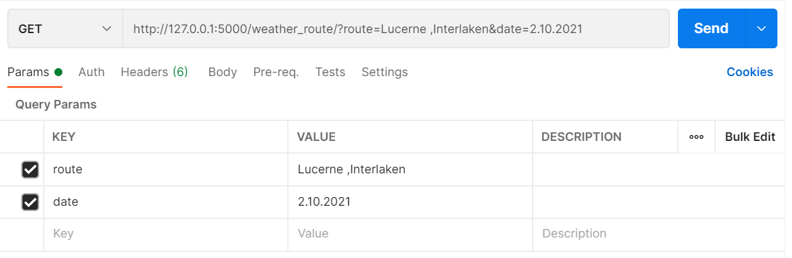
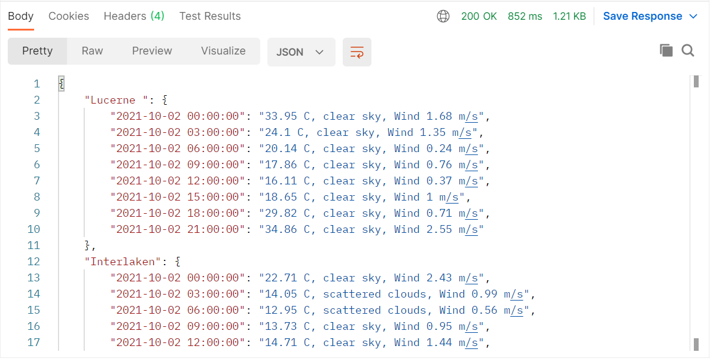

# Weather-Route-API

Build an API which tells me the weather on my route along my trip


## Overview

This project is made for anyone who is looking for an example of how to create a rest endpoint using Python and Flask
The project uses the  weather API https://openweathermap.org/ to request weather data for different cities and dates.
This project was written using Sublime Text Editor.

The API is also deployed on heroku at https://technical-app-heroku.herokuapp.com/. 
Some example queries for deployed heroku API :
* https://technical-app-heroku.herokuapp.com/weather_route/?route=Lucerne,Interlaken&date=2.10.2021
* https://technical-app-heroku.herokuapp.com/weather_route_bonus/?route=Bucharest,Lucerne,Interlaken&date=2.10.2021
* https://technical-app-heroku.herokuapp.com/past_trips/

## Installation

Requirements:

* Python 3.9+
* Flask 2.0.+
* Flask-SQLAlchemy 2.5.+
* Flask-Bcrypt 0.7.+
* requests 2.26.+

## Running the application

After you have performed all the dependency installations from above, you can run the following command on your terminal to start this app.


```shell
$ python weather.py
```


## Project Database

This project uses a local sqlite for a repository.


## Usage
When the API is up and running we can test the endpoints with Postman. 


## Example endpoint 1
This endpoint accepts only dates in the format 'dd.mm.yyyy.' and the date must be in the interval of the next 5 days, otherwise the API will return an error message.
The route can have a variate number of cities  and the upperbound limit is 24. At least one city is needed. 
This endpoint sends back a JSON where we can see the weather  (general weather, celsius degrees and wind speed) every three hours in the specified date, for every city from the route. 
If a City was not written correctly, an error message will be send instead of weather data. 

### Request



### Response



## Example endpoint 2 (bonus)
This endpoint accepts only dates in the format 'dd.mm.yyyy.' and the date must be in the interval of the next 5 days, otherwise the API will return an error message.
The route can have a variate number of cities, and the upperbound limit is 12 considering A perfect travel time interval would be between 9 and 21:00.Also,  At least one city is needed. 
This endpoint sends back a JSON where we can see the weather  (general weather, celsius degrees and wind speed) taking into account that time passes while we travel between cities (assuming that we have a magic car which takes exactly 1 hour between any 2 cities regardless of the distance).
If a City was not written correctly, an error message will be send instead of weather data. 

### Request


### Response


## Example endpoint 3 (bonus)
This endpoint is used to see the last 5 past trips which somebody queried for.

### Request


### Response
